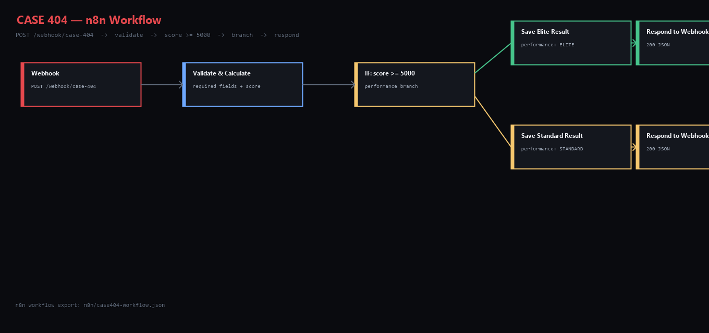

# CASE 404 — Juego de investigación detectivesca

> **"Cada pista esconde una historia."**

Un juego de detective interactivo y cinematográfico construido con **React 18**, **Vite**, **json-server** y **n8n**.
Asume el rol de un detective de campo: analiza escenas del crimen recién registradas, interroga sospechosos,
pondera la evidencia y presenta tu acusación antes de que se agote el tiempo.

> **Idioma:** todo el juego está en español.

---

## Features

- **10 casos completos** en español (3 FÁCIL / 4 MEDIA / 3 DIFÍCIL), **6 sospechosos** y **9 evidencias** por caso (60 sospechosos y 90 evidencias en total), cada uno con **una resolución distinta** — cada caso tiene un único culpable.
- **Interrogatorio con micro-expresiones** — el corazón del juego: citas a los sospechosos en una sala de interrogatorios y les haces preguntas (alibi, relación, motivo, general, prueba). Cada respuesta dispara una **reacción** que debes leer: *tranquilo, tenso, nervioso, evasivo o SE CONTRADICE*, con animación del retrato, monitor de **presión psicológica** y un registro de "señales" que se archiva en el expediente para decidir el veredicto.
- **Motor de IA conectado (interrogatorio en vivo)** — con una clave de API (Groq/OpenAI/OpenRouter) escribes **tus propias preguntas** al sospechoso y este responde **en tiempo real (streaming)**, con carácter propio: puedes preguntarle de cualquier tema (gustos, familia, opiniones) y responde como persona… para luego **retomar el caso** con un comentario personal. Cada respuesta se clasifica en un `reaction` para tu registro de señales. Sin clave, un motor local contextual da respuestas progresivas con la misma experiencia.
- **Progresión por ACTOS** — cada investigación avanza en 3 actos que se desbloquean según el tiempo transcurrido: las evidencias de actos futuros aparecen **bloqueadas**, algunos sospechosos solo se pueden citar más adelante, y la pregunta de la **prueba** (la confrontación con la evidencia clave) está disponible en el acto final. Todo esto hace los casos más largos y difíciles de adivinar.
- **Flujo interactivo por pasos** — recorrido guiado (**Escena → Interrogatorio → Evidencia → Veredicto**) donde cada paso se desbloquea al interactuar. Las evidencias aparecen **veladas** y solo se revelan al tocarlas. En la fase de intel puedes alternar entre **INTERROGATORIO** y **EXPEDIENTE** (dashboard de lectura: resumen, escena, informes y fichas).
- **Decisión entre opciones** — el paso final es un tablero de **veredicto por opciones**: los 6 sospechosos se muestran como tarjetas con retrato y una **ficha de señales** (lectura corporal del interrogatorio); eliges al culpable antes de presentar la acusación.
- **Retratos de los sospechosos** — 60 retratos SVG locales generados (`public/suspects/{id}.svg`) para que conectes mejor con cada personaje; funcionan incluso sin conexión y también se muestran **afuera**, en las tarjetas de la sala de casos.
- **Tarjetas de caso informativas** — además del título, dificultad y estado, cada tarjeta muestra la **descripción del caso**, la víctima, la localización y una **tira de retratos** con los 6 sospechosos de ese caso.
- **Estética de videojuego** — reconstrucción visual: fondo con aurora animada, viñeta cinematográfica, títulos con gradiente y glow, botones arcade, hero del Home rediseñado con estadísticas, y una sala de interrogatorios escenográfica de dos planos.
- **Base de datos local precargada** — el juego corre de inmediato sin json-server; lee de una copia embebida cuando la API no responde.
- **Briefing de misión** — toda investigación abre con una pantalla formal de briefing; el cronómetro solo arranca al pulsar *Aceptar tarea*.
- **Dossiers enriquecidos** — las fichas del expediente muestran retrato, nombre, profesión, edad, nivel de sospecha, relación con la víctima, coartada, motivo (*por qué parece culpable*), notas de expediente (según el acto) y descripción.
- **Efectos de sonido + música de suspenso sintetizados** — todo el audio se genera con la Web Audio API (sin archivos). Incluye selección, revelado, resuelto/fallido y tics de último minuto; una música ambiental de suspenso se activa desde la barra superior.
- **Interactividad** — las tarjetas se elevan al pasar el cursor, fade-in escalonado, overlay CRT con scanlines, tagline con efecto máquina de escribir y badge de estado de conexión (ONLINE / BASE LOCAL) en la barra superior.
- Interactive evidence board — select, analyse, mark
- Hint protocol (3 hints per case; each costs score points)
- Live scoring panel (visible bonus/penalty breakdown, floor guarantee)
- Live countdown timer with visual urgency cues
- Final-verdict confirmation modal
- Automatic scoring + rank calculation (S → F)
- Results dashboard with case report, solution explanation and evidence analysis bars
- Leaderboard with case filter
- Officer profile with career stats and full investigation history
- n8n webhook integration (exported workflow + live POST)
- Retry mechanism if the automation service is unreachable
- Full loading / error / empty state handling
- Responsive (mobile, tablet, desktop)
- Accessible (keyboard navigation, aria labels, focus states)

---

## Technologies

| Layer | Tech |
|-------|------|
| Frontend | React 18, Vite 5, React Router DOM 6, Framer Motion, Lucide React |
| Styling | Vanilla CSS with custom properties (glassmorphism, dark cinema aesthetic) |
| API | json-server 0.17 (REST mock) |
| Automation | n8n (local or self-hosted) |
| Language | JavaScript (ESM) |

---

## Installation

```bash
# 1 — Clone
git clone https://github.com/<you>/case-404.git
cd case-404

# 2 — Install
npm install

# 3 — Environment (optional, defaults work locally)
cp .env.example .env

# 4 — (Recommended) Start API server + Vite dev server
npm run dev:full

# Or just the frontend — cases are served from the preloaded local database
npm run dev
```

Open **http://localhost:5173** in your browser.

---

## Environment Variables

Create a `.env` file at the project root (see `.env.example`):

| Variable | Default | Description |
|----------|---------|-------------|
| `VITE_API_URL` | `http://localhost:3001` | json-server API base URL |
| `VITE_N8N_WEBHOOK_URL` | `http://localhost:5678/webhook/case-404` | n8n webhook URL for investigation reports |
| `VITE_AI_ENABLED` | `false` | Activa el motor de IA en el interrogatorio (`true`) o usa el banco offline (`false`) |
| `VITE_AI_BASE_URL` | `https://api.groq.com/openai/v1` | Base de la API estilo OpenAI (`/chat/completions`) |
| `VITE_AI_KEY` | _(vacía)_ | Clave de API del proveedor |
| `VITE_AI_MODEL` | `llama-3.3-70b-versatile` | Modelo de chat a usar |
| `VITE_AI_TEMPERATURE` | `0.8` | Creatividad de las respuestas |

**Never commit `.env` to a public repository.**

---

## AI Interrogation Engine

The interrogation room connects to any OpenAI-compatible chat API (`/chat/completions`) that supports
**streaming (SSE)**. With it enabled:

```
Escribes tu pregunta  →  POST {VITE_AI_BASE_URL}/chat/completions  →  streaming SSE
                          (system: personaje, coartada, motivación, rol de culpable)
                                          ↓
                              respuesta en vivo en la sala  →  clasificación reaction
                                          ↓
                          señal archivada para el veredicto (offline-friendly)
```

- The system prompt gives the model the suspect's **identity, alibi, motive, relation and case context**;
  the culprit is told (privately) to hold firm, get nervous under pressure and contradict slightly — never to confess.
- The reply is streamed token by token into the log bubble, then classified into
  `CALM / TENSE / NERVOUS / EVASIVE / CONTRADICTS` for the tells panel.
- You get **up to 5 free-form questions per suspect** (same budget as the offline bank).
- If `VITE_AI_ENABLED=false`, the key is empty, or the provider is unreachable, the room silently
  falls back to the pre-generated `interrogation` answers — the game is fully playable offline.

### Providers

| Provider | `VITE_AI_BASE_URL` | Notes |
|----------|--------------------|-------|
| Groq | `https://api.groq.com/openai/v1` | Very fast streaming, free tier |
| OpenAI | `https://api.openai.com/v1` | `gpt-4o-mini` works well |
| OpenRouter | `https://openrouter.ai/api/v1` | One key for many models |

### Settings

```bash
cp .env.example .env
# .env
VITE_AI_ENABLED=true
VITE_AI_BASE_URL=https://api.groq.com/openai/v1
VITE_AI_KEY=tu-clave
VITE_AI_MODEL=llama-3.3-70b-versatile
VITE_AI_TEMPERATURE=0.8
```

Restart the dev server after editing `.env` (Vite caches env at startup).

---

## Offline / Local Mode

The frontend ships with an embedded copy of the database (`src/data/database.js`). Every request is
**remote-first**: the app tries json-server, and if it cannot be reached within ~3 s it transparently
falls back to the embedded data.

- **GET requests** (cases, suspects, evidence, player) → served from the embedded dataset.
- **Writes** (new results, player stats) → persisted in `localStorage` when offline.
- Results stored with `storedLocally: true` are merged and auto-deduplicated when the API comes back.
- The navbar shows a live **CID NETWORK ● ONLINE / LOCAL DATABASE ○ OFFLINE** badge so you always know where data is coming from.

This means `npm run dev` alone is enough to play the full game; `npm run server` is only needed to
share data between browser sessions or inspect it via the REST API.

---

## n8n Integration

### Import the workflow

1. Open your n8n instance (default: http://localhost:5678).
2. Click **Workflows → Import from File**.
3. Select `n8n/case404-workflow.json`.
4. Toggle the workflow to **Active**.

### How it works

```
React  →  POST (fetch)  →  Webhook (n8n)
                               ↓
                          Validate & Calculate Performance
                               ↓
                          IF score >= 5000
                          ↙               ↘
                  Save Elite Result   Save Standard Result
                          ↓                  ↓
                  Respond to Webhook  Respond to Webhook
```

The workflow returns:

```json
{
  "success": true,
  "message": "Investigation processed successfully",
  "performance": "ELITE | STANDARD",
  "score": 8420,
  "rank": "A"
}
```

The React frontend reads this response and shows a confirmation panel on the results page.

### Replacing the in-memory store

The exported workflow stores results in a global JavaScript object inside the n8n Code node.
This is intentional for zero-dependency academic use.
To persist results, replace the Code node with a **Google Sheets**, **Postgres**, or **HTTP Request** node.
See comments inside each Code node for guidance.

---

## Game Instructions

1. Activa (opcional) la **música de suspenso** en la parte superior derecha del navbar.
2. Abre **CASOS** en el menú lateral.
3. Elige un caso disponible → aparece el **briefing** con los datos del caso y la ventana de tiempo.
4. Pulsa **ACEPTAR TAREA** — arranca el cronómetro y se desbloquea la investigación.
5. Recorre el **flujo por pasos** (barra superior): los pasos se desbloquean uno tras otro conforme interactúas (Escena → Interrogatorio → Evidencia → Veredicto).
6. En **ESCENA** lee la historia y el texto del acto actual. Con el tiempo, se desbloquean actos: evidencia futura, sospechosos citables y la prueba final.
7. En **INTERROGATORIO**, elige un sospechoso del rail y hazle preguntas. Observa su **reacción** en el retrato (tranquilo / tenso / nervioso / evasivo / SE CONTRADICE) y la **barra de presión**. Cada respuesta se archiva como "señal". Si el **motor de IA** está conectado, tienes un campo para **escribir tu propia pregunta** y la respuesta llega **en vivo**, o toca las tarjetas sugeridas (máx. 5 por sospechoso). Puedes alternar con **EXPEDIENTE** para leer el resumen, la escena, el laboratorio y las fichas.
8. La pregunta de **PRUEBA** (confrontación con la evidencia clave) solo aparece en el acto final: ahí es donde las contradicciones se notan más.
9. En **EVIDENCIA**, examina las pistas **veladas** (toca una vez) y márcalas (toca dos veces) las que refuercen tu teoría. Contrasta los informes con lo que te dijeron los sospechosos.
10. Usa el **Protocolo de pistas** si te atascas (cada pista cuesta −500 puntos).
11. En **VEREDICTO**, elige al culpable **entre las opciones** (cada fibra muestra las señales de lenguaje corporal que archivaste) y marca al menos una evidencia.
12. Pulsa **PRESENTAR VEREDICTO** → confirma en el modal.
13. En el reporte, el panel **LA RESPUESTA DEL CASO** desvela quién era el responsable (con retrato), su motivo, las pruebas contundentes y la resolución completa del caso.
14. Consulta tu puntaje, rango y el reporte; la clasificación y tu perfil se actualizan automáticamente.

> Las tarjetas de la **sala de casos** ya muestran la descripción, la víctima, la localización y los 6 retratos de cada caso, para que decidas qué caso tomar antes de entrar.

---

## Project Structure

```
case-404/
├── public/
│   ├── favicon.svg
│   └── suspects/           # 60 retratos SVG de sospechosos ({id}.svg)
├── src/
│   ├── components/
│   │   ├── Navbar.jsx
│   │   ├── Sidebar.jsx
│   │   ├── CaseCard.jsx
│   │   ├── CaseBriefing.jsx
│   │   ├── CaseDashboard.jsx
│   │   ├── InterrogationRoom.jsx
│   │   ├── EvidenceCard.jsx
│   │   ├── EvidenceBoard.jsx
│   │   ├── SceneStepper.jsx
│   │   ├── StoryPanel.jsx
│   │   ├── CaseHeader.jsx
│   │   ├── Timer.jsx
│   │   ├── ScorePanel.jsx
│   │   ├── InvestigationProgress.jsx
│   │   ├── HintPanel.jsx
│   │   ├── FinalVerdict.jsx
│   │   ├── Modal.jsx
│   │   ├── Notification.jsx
│   │   ├── RankBadge.jsx
│   │   ├── StatTile.jsx
│   │   ├── Tag.jsx
│   │   ├── ProgressBar.jsx
│   │   ├── LoadingState.jsx
│   │   ├── ErrorState.jsx
│   │   ├── EmptyState.jsx
│   │   └── layout/
│   │       └── AppLayout.jsx
│   ├── pages/
│   │   ├── Home.jsx
│   │   ├── Cases.jsx
│   │   ├── Investigation.jsx
│   │   ├── Results.jsx
│   │   ├── Leaderboard.jsx
│   │   ├── Profile.jsx
│   │   └── NotFound.jsx
│   ├── services/
│   │   ├── api.js
│   │   ├── n8n.js
│   │   ├── ai.js              # Motor de IA de interrogatorio en vivo (streaming)
│   │   └── sound.js
│   ├── data/
│   │   └── database.js
│   ├── hooks/
│   │   ├── useCountdown.js
│   │   └── usePlayer.js
│   ├── utils/
│   │   ├── scoring.js
│   │   ├── gameLogic.js
│   │   └── format.js
│   ├── App.jsx
│   ├── main.jsx
│   └── index.css
├── scripts/
│   ├── expand-cases.mjs                   # Añade casos completos (10 en total) a db.json
│   ├── generate-portraits.mjs             # Genera los retratos SVG que falten en public/suspects
│   └── generate-interrogation.mjs         # Genera el campo `interrogation` y la base embebida
├── n8n/
│   ├── case404-workflow.json
│   └── workflow-screenshot.png
├── db.json
├── .env.example
├── .gitignore
├── package.json
├── vite.config.js
├── README.md
└── REQUIREMENTS.md
```

---

## API Endpoints

| Method | URL | Description |
|--------|-----|-------------|
| `GET` | `/cases` | List all cases |
| `GET` | `/cases/:id` | Single case with all details |
| `GET` | `/suspects?caseId=:caseId` | Suspects for a case |
| `GET` | `/evidence?caseId=:caseId` | Evidence items for a case |
| `GET` | `/players/:id` | Player profile |
| `PUT` | `/players/:id` | Update player stats |
| `GET` | `/results` | All investigation results |
| `GET` | `/results/:id` | Single result |
| `POST` | `/results` | Save a new result |
| `PUT` | `/results/:id` | Update result (n8n status) |

---

## Development Scripts

| Script | Description |
|--------|-------------|
| `npm run dev` | Start Vite dev server |
| `npm run server` | Start json-server API |
| `npm run dev:full` | Start both concurrently |
| `npm run build` | Production build |
| `npm run preview` | Preview production build locally |

---

## Screenshots

| Workflow diagram |
|:---:|
|  |

Replace `workflow-screenshot.png` with a real screenshot after activating the workflow in n8n.

---

## License

Academic use only.
